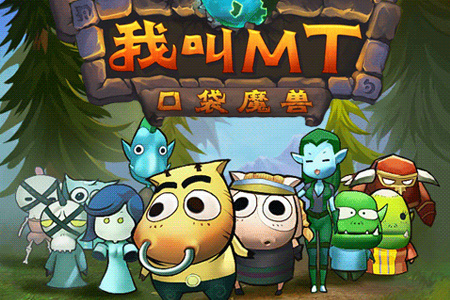
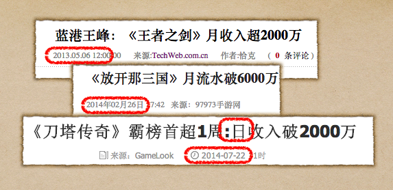
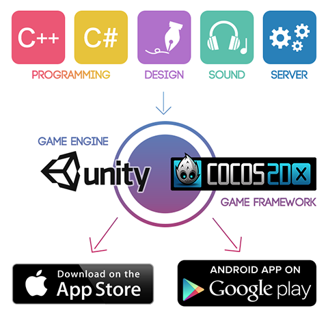

#游戏开发新手村之选择职业

##引子

>有一些人，他们也希望赚钱，但他们更多的是凭着理想工作。也许我们这个社会叫他们理想主义者。 

>他们离群索居，只是一心一意沉浸在自己做出的世界中。 

>他们是玩着超级玛丽长大的一代，当年那个8位低像素的简单美好在他们心中埋下了种子。

>他们是被传奇，奇迹，CS，仙剑，剑侠等‘毒害’的一代。

>直到他们中的一些成为亿万富翁，他们终于被整个世界认可。

##写在前面

首先，这篇文章都能被你发现，对，说的就是你，你已经离你的梦想很近了！！

虽然这个系列文章是写给初学者的，如果你是一个游戏开发老手，也可以出门左转，直达
[泰然网进阶教程合集](http://www.tairan.com/tutorials/ "tutorials")

##进入新手村

2012年底，正好是手游《我叫mt》大放异彩的时候，超高的月收入，让投资者对手游界趋之如骛.好吧，这个说法不形象，更进一步说，从那以后，开启了资本对手游的“恶狗抢屎”模式。

一款手游轻松突破3000w的月收入，是其他行业不敢想象的事情。也就是说，从2012年开始，只要你是做手游的，拉上一票兄弟，基本都能获得一笔不低于200w的投资，这笔钱足够你的团队撑上18个月。

而今天，2年时间过去了，我们再来看手游圈，2年间，手游的月收入不断被刷新。

>站在风口上，猪都能吹飞！！

虽然，国内的游戏行业不是太健康，热门的是贩卖虚拟道具为主类似电子商务的游戏。

也因为同质化严重，缺乏创新，也被大家戏称为搬砖行业。不清楚你喜欢想做的是哪种游戏，是否想把游戏开发作为职业还是只是把其当做爱好。如果你想进入游戏行业（如果我们对它的理解是一样的话），需要先考虑下自己职业规划。

看看周围，看看身边所发生的一切，究竟有几个人能把年少时的梦想坚持到最后，低物质，低社交，牺牲很多东西作为底线，只是为了让更多的人分享这份“天真”，当然，最后他们都成百万，千万，亿万富翁了，这就是游戏圈，你还能找到比着更纯粹的圈子吗？

此时此刻，大家身边肯定有一大帮人一边极尽酸腐的打压年轻人的奋进，一边夸大自己生活里的困难以便吐出“我也不容易”的烂槽。

本来，这一章，我是想分析一下目前做游戏的市场形式好过做应用的，不过，说到底就是我当年跳入游戏火坑的想法：

***我就是喜欢游戏，我做自己想做的，并乐在其中！！！***

##游戏引擎&&开发语言

###什么是引擎

***游戏引擎*** 是指一些已编写好的游戏系统或者核心组件的集合。（我这句话写的真像教科书）

简言之，如果我之前已经做了一个游戏A，现在想做一个游戏B。虽然游戏完全不同，但很多代码是可以重复利用的，比如英雄的装备系统，比如按钮，比如对话框。这些组件完全可以从游戏A中直接Copy到游戏B中，从而减少代码量。而可以通用的这部分代码，在我们做了游戏C，D,E,F，G以后，就形成了一个我们自己的游戏框架，这就是一个引擎的雏形。***说白了，就是让今后做的游戏像搭积木一样。***

在现代的游戏开发中，使用引擎的目的在于让游戏设计者能容易和快速地做出游戏程式而不用由零开始。

现代的***游戏引擎典型特征是跨平台***，只用一次编码，游戏即可在诸如 Linux、Mac OS X、微软Windows这样的系统中运行。

游戏引擎包含以下系统：渲染引擎（即「渲染器」，含二维图像引擎和三维图像引擎）、物理引擎、碰撞检测系统、音效、脚本引擎、电脑动画、人工智能、网络引擎以及场景管理。

***硬件概念***
引擎的渲染系统通常建立在一套高级图像API之上，诸如DirectX或OpenGL，这些API封装了GPU和显卡的部分功能。级别低一点的如DirectX、SDL和OpenAL也经常使用，他们提供对其他硬件设备的独立支持，诸如输入设备（鼠标、键盘、控制杆）、网卡、声卡。在硬件加速图形卡出现以前，开发者使用软件渲染。现在软件渲染依然被广泛用于非及时图像的渲染，或者是用户的硬件设备不支持硬件渲染。 ***而现在我们使用的所有引擎都是基于DirectX或OpenGL封装而来的。***

###游戏引擎

目前市面上使用率最高的游戏引擎是Unity3D（市场份额27%）和Cocos2D-x（市场份额60%）。

***Unity3D*** 国内游戏27%是由unity做的，unity确实是更先进的游戏引擎，不过由于包体积过大，游戏系能要求高等原因，在国内市场份额一直次于Cocos2d-x。

***Cocos2d-x*** 世界上使用率最高的游戏引擎，国内有6成游戏使用该引擎，不论你是创业，还是找工作，用这个引擎的成功概率最高。

简言之：unity就像5星级饭店，装修豪华，菜品优秀，但不是每个人都吃得起的，在二三线城市几乎不可能存活。Cocos2d-x就像苍蝇馆子，装修破烂却味道好，容易进入千家万户。

###支持语言

Cocos2d-x支持语言有：c++（主要），js，lua

unity3d支持的语言有：c#（主要），js，lua（支持较差）

###对于“学习”而言

Cocos2d-x是比较好理解的。它是传统的OOP结构（面向对象），对于有编程经验的人来说，是最好不过了。就连Unity3d上，也有一个很火的2D框架，Futile，是模仿Cocos2d-x的架构和代码风格。从Cocos2d-x上手接触游戏引擎，是一个不错的选择。

而Unity3d是Component-Based结构（基于组件），对于OOP背景的程序员来说，一开始会觉得别扭。而且Unity3d有很多针对3d模型、3d动画、优化等等的商用功能，对于初学者来说会有点overwhelming的感觉。而且无论如何使用Unity3d，总需要在editor里进行大量操作，对理解游戏引擎和代码架构来说，并不是一个很好的方式。

另外，在语言的学习中，我建议大家还是从c++开始，毕竟这是效率最高，也是使用率最高的语言，学会后，其他语言皆可触类旁通。

###从“开发”的角度来说

Cocos2d-x是一个“纯正”的c++引擎。虽然可以利用CocosStudio和其他一些工具进行图形化操作，虽然前期开发效率始终不够Unity3d高，但是全部开放的底层代码，对于研究是一件大大的好事，但是对于创作而言，未必是福音。

而Unity3d则是一个高效的IDE+代码库。它很好地封装了底层代码，提供许多简便的图形操作，还有商业级的高级功能。对于开发而言，制作Demo而言是更好地选择。之前大多数开发者对Unity3d的认识还停留在3D开发，但2013年末的2D支持让更多人选择Unity3d进行2D开发虽然使用率不算高。

***unity3d开发的问题在开发后期***，多渠道打包，多分辨率支持，不同android版本支持，几乎可以拖垮一切初入行的团队。

###结论

我认为作为计算机软件专业的童鞋来说通过Cocos2d-x是最好的选择！那么，从下一章开始，我们将会真正进入游戏开发方向，我将在未来的章节中，教会大家从零开始学会游戏开发！放心吧，我对你们有信心！

##引用：
http://www.zhihu.com/question/22552588

http://movie.douban.com/subject/7015793/